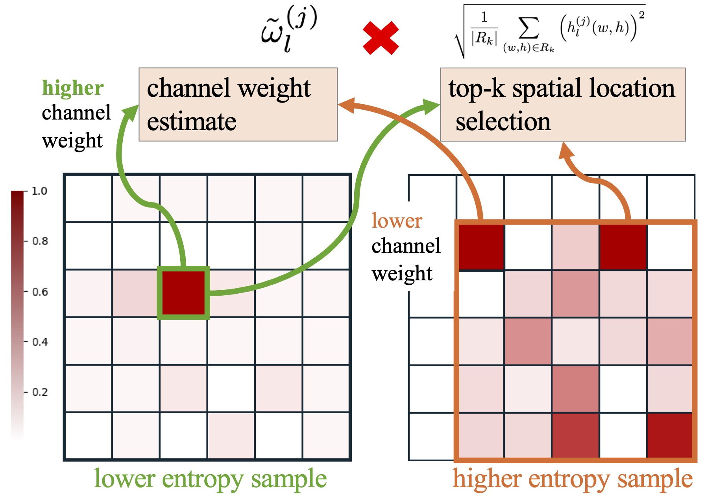
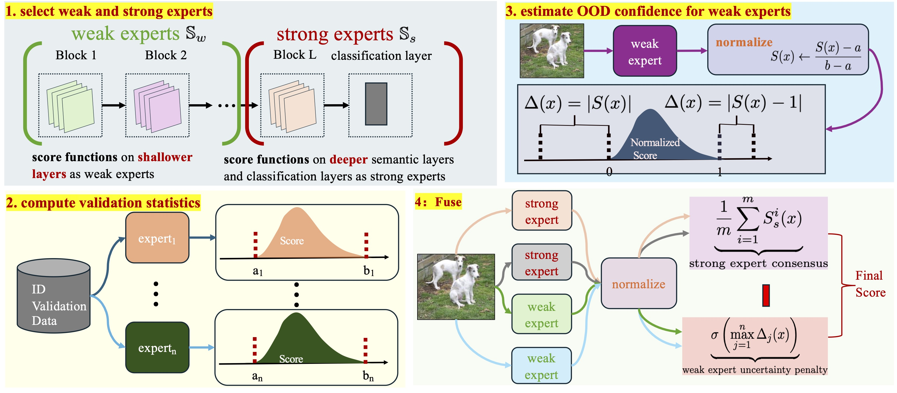

# FuseNorm

**FuseNorm** is a method for OOD detection which consists of two main components: (1) Adaptive Top-k FeatureNorm (ATF) and (2) Strong–Weak Experts Fusion framework (FuseNorm).

1. ATF:     Adaptive Top-k  FeatureNorm (ATF)  simultaneously performs spatial top-k selection and  channel-wise energy weighting by analyzing the intra-channel energy distribution of feature maps.

<p align="center">
  
</p>

2. FuseNorm:  a strong–weak experts fusion framework that dynamically integrates confident cues from strong experts with complementary evidence from weaker ones in an uncertainty-aware manner


<p align="center">
  
</p>

## Project Structure

1. **Experimental Logs**
    
    - All experiment logs in `.ipynb` format are located in the folder:
        
        ```
        exp_0/
        ```
        
2. **Core Implementation**
    
    - The main FuseNorm logic is implemented in:
        
        ```
        methods/score.py
        ```
        

### Key Functions

#### 1. `compute_id_statistics`

```python
def compute_id_statistics(scores_in, qs=0.1, qe=99.9):
    """
    Compute per-layer statistics (mean, std, 0.5% and 99.5% percentiles) for in-distribution scores.

    Args:
        scores_in (np.ndarray): Array of shape (L, N), where L is the number of layers and N is the number of samples.

    Returns:
        means (np.ndarray): Mean score for each layer, shape (L,).
        stds (np.ndarray): Standard deviation for each layer, shape (L,).
        p005 (np.ndarray): 0.5th percentile for each layer, shape (L,).
        p995 (np.ndarray): 99.5th percentile for each layer, shape (L,).
    """
    scores_in = np.asarray(scores_in)
    means = np.mean(scores_in, axis=1)
    stds = np.std(scores_in, axis=1) + 1e-8  # avoid division by zero
    ps = np.percentile(scores_in, qs, axis=1)
    pe = np.percentile(scores_in, qe, axis=1)
    return means, stds, ps, pe
```

#### 2. `adaptive_topk_channel_weight` (ATF)

```python
def adaptive_topk_channel_weight(x, k_min=0.1, k_max=0.25, alpha=0.0, eps=1e-8):
    """
    Adaptive Top-k Channel Weighted Norm (ATF)
    ------------------------------------------
    Computes an uncertainty-aware spatial-channel aggregation of feature activations.
    Adaptively determines:
      1. The spatial selection ratio (Top-k) per sample
      2. The channel contribution weights based on entropy

    Args:
        x (torch.Tensor): Feature map of shape [B, C, H, W].
        k_min (float): Minimum spatial selection ratio.
        k_max (float): Maximum spatial selection ratio.
        alpha (float): Smoothing factor controlling uniform prior strength.
        eps (float): Small constant for numerical stability.

    Returns:
        torch.Tensor: Aggregated feature norms of shape [B].
    """
    B, C, H, W = x.shape
    x_flat = x.view(B, C, -1)
    energy = x_flat.pow(2)

    # ---- (1) Compute channel-wise entropy ----
    p = energy / (energy.sum(dim=-1, keepdim=True) + eps)
    entropy = -(p * (p + eps).log()).sum(dim=-1)
    entropy = entropy / torch.log(torch.tensor(float(H * W), device=x.device))

    # ---- (2) Derive channel weights (low entropy → high confidence) ----
    weights = 1.0 - entropy
    weights = weights / (weights.sum(dim=-1, keepdim=True) + eps)

    # Apply entropy smoothing
    uniform = torch.full_like(weights, 1.0 / C)
    weights = (1 - alpha) * weights + alpha * uniform
    weights = weights / (weights.sum(dim=-1, keepdim=True) + eps)

    # ---- (3) Determine adaptive Top-k per sample ----
    entropy_mean = entropy.mean(dim=-1)
    k_ratio = k_min + (k_max - k_min) * entropy_mean
    k_vals = (k_ratio * (H * W)).long().clamp(min=1)

    # ---- (4) Compute weighted Top-k norm ----
    norms = []
    for i in range(B):
        k_top = int(k_vals[i])
        top_vals, _ = torch.topk(energy[i], k_top, dim=-1)
        per_ch_norm = top_vals.mean(-1).sqrt()
        norm_val = (per_ch_norm * weights[i]).sum()
        norms.append(norm_val)

    return torch.stack(norms)
```

#### 3. `fuse_norm`

```python
def fuse_norm(scores_main, scores_other):
    """
    Fuse scores from strong and weak experts (FuseNorm).

    Args:
        scores_main (np.array): Strong expert scores [N]
        scores_other (np.array): Weak experts' normalized scores [L, N]

    Returns:
        fused_score (np.array): Adjusted strong expert scores [1, N]
        delta_score (np.array): OOD confidence adjustment [1, N]
    """
    scores_main = np.atleast_2d(np.copy(scores_main))
    scores_other = np.copy(scores_other)

    # Mean strong expert score across multiple cues (if any)
    scores_main_mean = np.mean(scores_main, axis=0, keepdims=True)

    # Compute deviation for weak experts
    s_high = scores_other > 1
    s_low = scores_other < 0
    scores_other = np.abs(scores_other * s_low + (scores_other - 1) * s_high)

    # Take max deviation among weak experts
    scores_other = np.max(scores_other, axis=0, keepdims=True)

    # Scale deviation (confidence calibration)
    delta_score = df(scores_other)

    # Fuse: subtract deviation from strong expert
    fused_score = scores_main_mean - delta_score

    return fused_score, delta_score
```

3. **Full Code Release**
    
    - The complete codebase will be publicly released upon acceptance of the associated paper.
        

