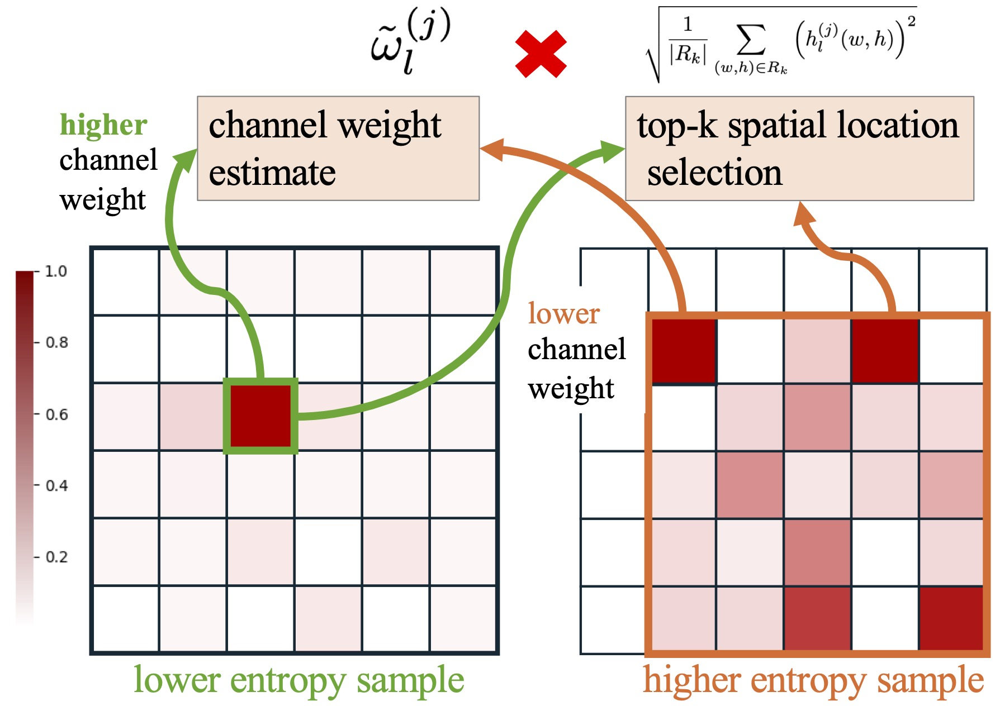
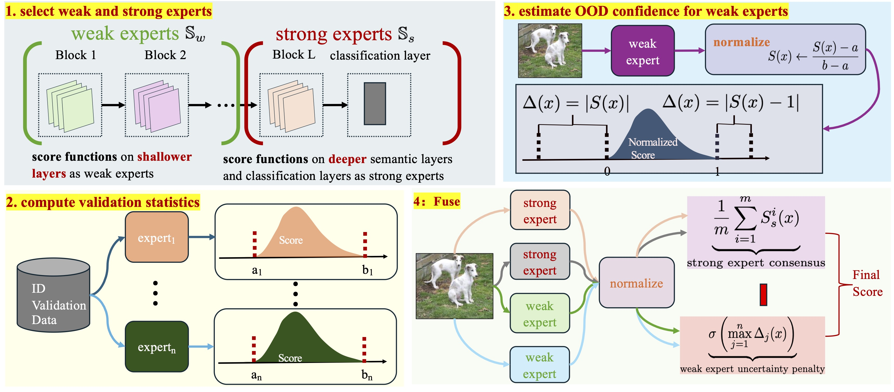
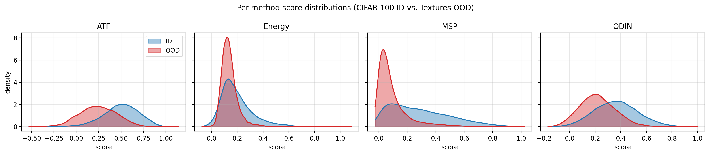
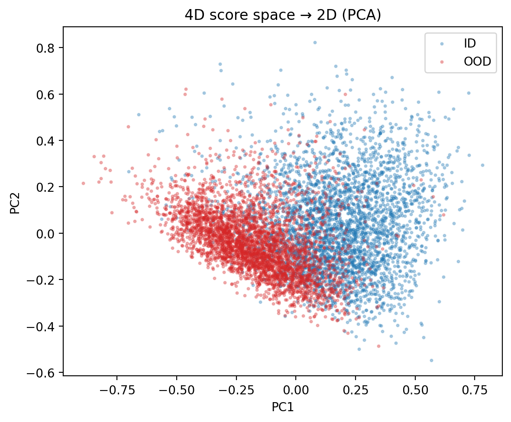

# SW-Fusion: Strong-Weak Experts Fusion for OOD Detection

This repository contains the  PyTorch implementation of:

> **Strong–Weak Experts Fusion for Robust Out-of-Distribution Detection**

## Overview

SW-Fusion is a training-free, post-hoc OOD detection framework that
aggregates heterogeneous OOD cues via a **Strong-Weak Experts**
paradigm:

- **Adaptive Top-k FeatureNorm (ATF)**: a feature-activation score
  with per-channel adaptive top-k spatial selection and entropy-based
  channel weighting.
- **SW-Fusion**: a Strong-Weak Experts framework that averages a
  consensus of *strong* experts (deep, rectified, feature-energy)
  and gates the contribution of *weak* experts (shallow-layer
  ATF scores) by an uncertainty-aware penalty.

1. ATF:     Adaptive Top-k  FeatureNorm (ATF)  simultaneously performs spatial top-k selection and  channel-wise energy weighting by analyzing the intra-channel energy distribution of feature maps.

  

2. FuseNorm:  a strong–weak experts fusion framework that dynamically integrates confident cues from strong experts with complementary evidence from weaker ones in an uncertainty-aware manner

  

## Example 

1D score distributions of each individual strong expert on ID (blue) and OOD (red). Each individual score exhibits substantial ID/OOD overlap, confirming that no single score suffices.

  

When the four scores are jointly projected onto the leading two principal components, ID and OOD form two well-separated clusters with only marginal overlap at the outer contour, demonstrating that the four scores encode complementary information that a consensus can aggregate

  

**Full Code Release**: The complete codebase will be publicly released upon acceptance of the associated paper.
        

